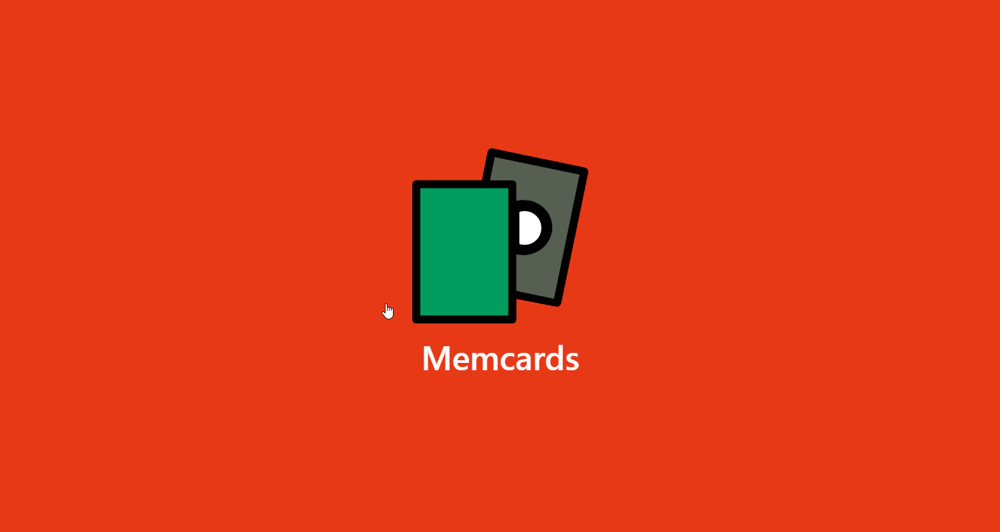

# Memcards

A flashcard app to help you remember things easily. Study pre-made decks or create your own.
Make flashcards more effective with photos provided by [Unsplash](https://unsplash.com/)!

## [View Demo](https://memcards.netlify.com/)

## Frontend

- React
- Redux
- Styled Components
- Bootstrap
- [React-Spring](https://www.react-spring.io/) for animation

## Backend

To learn different tech stacks, I rebuilt the backend multiple times using different technologies. Links to each iteration are below

## [Firebase/GCP](./src/firebase)

## [MERN Stack in typescript](/server)
